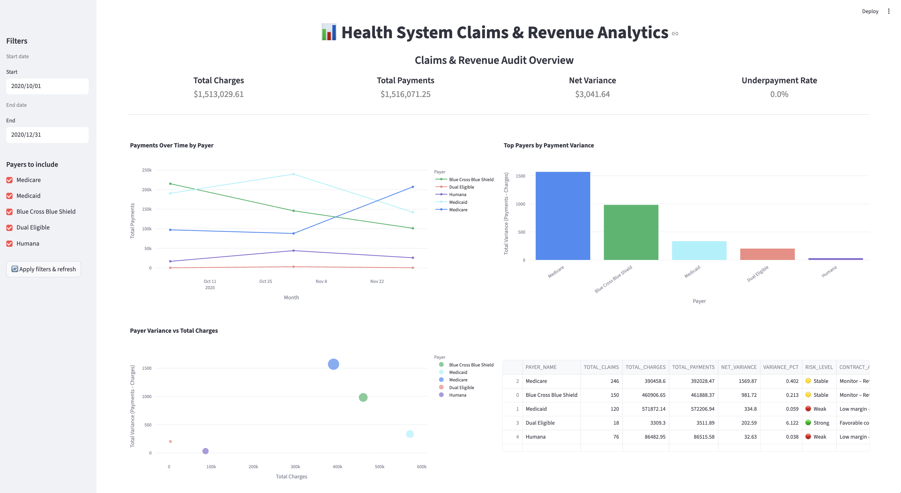
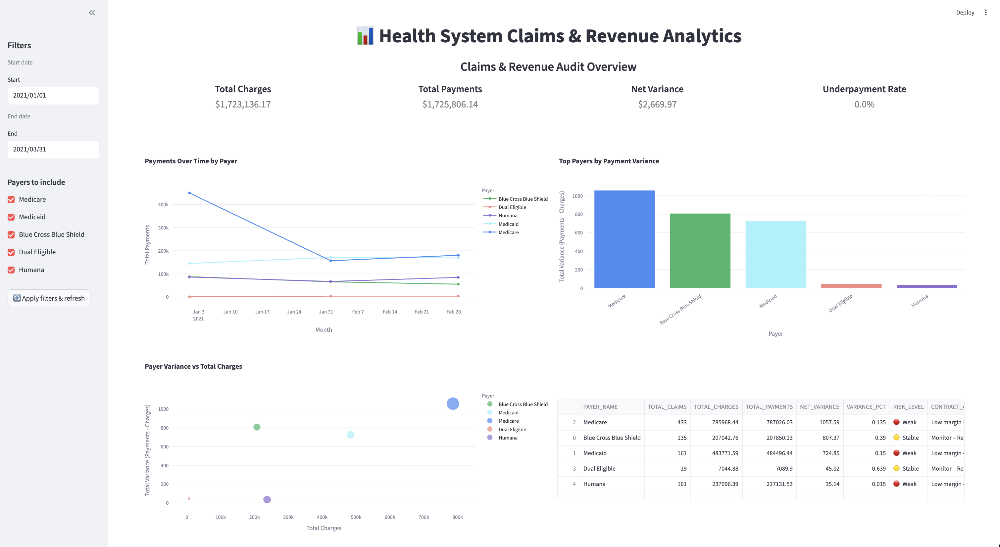

# Medi-Claim-Analytics-Multi-Hospital-Network

## Health System Claims & Revenue Analytics

### Overview
This project demonstrates how **Snowflake-based data warehousing and modeling** can be combined with a **Streamlit dashboard** to review **insurance payer payment performance for a selected period** using claims-level financial data.

The solution enables **period-based payer performance review** to identify which insurers require follow-up, monitoring, or investigation.

---

### Problem Statement
Health systems need a simple and repeatable way to evaluate **insurance payment behavior for a specific time window**, as payer performance can vary across periods and is often identified too late through manual reviews.

---

### Tech Stack
- **Snowflake** – Data warehousing & SQL modeling  
- **SQL** – Aggregation and analytics logic  
- **Python** – Data access and transformation  
- **Streamlit** – Interactive analytics dashboard  
- **Plotly** – Visualizations  

---

### Data Modeling (Snowflake)

#### Core Tables Used
- **CLAIMS_AUDIT**  
  Claims-level financial and audit data including charges, payments, variance, and exception flags.

- **DIM_PAYERS**  
  Maps payer identifiers to readable payer names.

The model separates **raw claim activity** from **payer-level interpretation**, enabling consistent analytics across time periods.

---

### Analytics & Metrics
For each payer and selected period, the dashboard computes:
- **Total Claims** – scale of interaction  
- **Total Charges** – expected revenue baseline  
- **Total Payments** – realized revenue  
- **Net Variance** – absolute payment deviation  
- **Variance %** – normalized comparison across payers  

These metrics form a **payer performance scorecard** for the selected period.

---

### Dashboard Capabilities
- Period-based filtering (month / quarter / custom range)
- Payer-level comparison and ranking
- Payment trends over time
- Variance impact and risk visualization
- Summary table with interpretive risk labels

---

### Dashboard Preview

**Payer Performance – Q1 2020**

**Payer Performance – Q1 2021**

---

### Business Use Case
The dashboard supports **insurance payer performance review**, helping teams:
- Decide which payers require follow-up or investigation
- Monitor borderline payer behavior over time
- Allocate audit and review effort efficiently
- Communicate clear, data-backed summaries to leadership

---

#### Dataset
This project uses a **synthetic healthcare claims dataset** designed to simulate real-world payer behavior.  
No real patient or insurer data is used.
Link: [Synthea](https://synthea.mitre.org/)

---

### Why This Project
This project showcases how **Snowflake data modeling + Streamlit** can rapidly deliver **decision-ready analytics**, turning warehouse data into an actionable payer review solution rather than static reporting.
