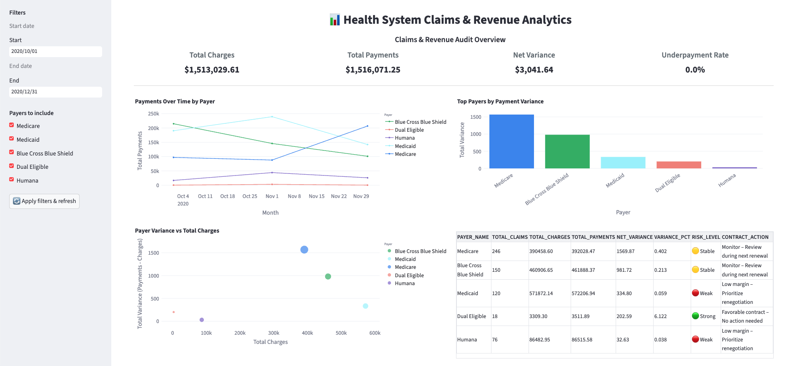
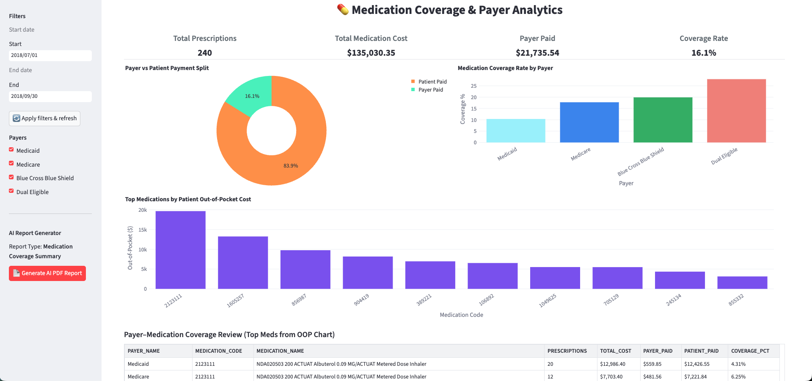

# Medi-Claim-Analytics-Multi-Hospital-Network

End-to-end example of building **lightweight, business-ready healthcare analytics** using:

- **Snowflake** for cloud data warehousing & modeling  
- **Python + SQL** for transformations  
- **Streamlit + Plotly** for interactive dashboards  
- **OpenAI + LangGraph** for AI-generated PDF summaries (medication coverage)

The project shows how you can go from **warehouse tables → curated views → decision-ready dashboards** without a heavy React/SPA deployment, while still supporting rich, business-focused features.

---

## 1. Project Overview

Health systems often have rich claims and medication data in the warehouse, but:

- Business users see it only as **static reports** or **ad-hoc SQL**.
- Building a full web app for every use case is **overkill**.
- Teams want **quick, explainable tools** that sit on top of Snowflake and answer concrete questions.

This repo demonstrates a reusable pattern:

> **Snowflake models + thin Python layer + Streamlit dashboards**  
> → fast to build, easy to iterate, still robust enough for real decision support.

To showcase this, the project focuses on two realistic hospital use cases:

1. **Claims & Revenue Audit** – How are payers actually paying our claims?
2. **Medication Coverage & Payer Analytics** – Where are patients bearing high out-of-pocket cost?

Both use the same underlying stack and design principles.

---

## 2. Tech Stack

- **Snowflake**
  - Central data warehouse
  - Fact tables for claims and medications
  - Dimensions for payers and other attributes
- **SQL**
  - Aggregations, KPIs, and business rules pushed down to Snowflake
- **Python**
  - Data access (Snowflake connector via `Connect.run_query`)
  - Light transformation and metric calculation
- **Streamlit**
  - Interactive dashboards with custom layout & UX
  - Sidebar filters, date pickers, payer selectors
- **Plotly**
  - Line charts, bar charts, scatter plots, and donut charts
- **OpenAI + LangGraph + ReportLab** (Medication coverage dashboard)
  - AI-generated, 2-page PDF summaries
  - Uses only dashboard aggregates (no raw PHI)
  - Clean, branded PDF layout

---

## 3. Data Modeling (Snowflake)

### Core Tables

- **`PUBLIC.CLAIMS_AUDIT`**  
  Claims-level financial/audit data:
  - Charges, payments, adjustments, transfers
  - Net variance (payments vs charges)
  - Exception categories (e.g., underpaid claims)
  - Key dates (service date, transaction dates)

- **`PUBLIC.FACT_MEDICATIONS`**  
  Medication-level facts:
  - Patient, payer, encounter, medication code/name
  - Base cost, payer coverage, total cost
  - Dispenses / prescription counts

- **`PUBLIC.DIM_PAYERS`**  
  Payer dimension:
  - `PAYER_ID`, human-readable `PAYER_NAME`

The warehouse separates:

- **Raw events** (claims & medications) from
- **Business-ready aggregates** used in the dashboards.

This pattern lets you plug new dashboards into the same curated tables without rebuilding pipelines.

---

## 4. Dashboard 1 – Health System Claims & Revenue Analytics

### Purpose

Review **payer payment performance** over a selected period, so finance and contracting teams can:

- See which payers are **underperforming**
- Prioritize **follow-up and renegotiation**
- Track **payment behavior** over time by payer

### Dashboard 1 Preview


### Key Features

- **Global filters**
  - Date range based on claim transaction dates
  - Multi-select payer filter (Medicare, Medicaid, BCBS, Dual Eligible, Humana)

- **KPIs**
  - **Total Charges** – expected revenue baseline  
  - **Total Payments** – realized revenue  
  - **Net Variance** – payments – charges  
  - **Underpayment Rate** – share of claims marked as underpaid  

- **Visuals**
  1. **Payments Over Time by Payer**  
     - Monthly line chart (Plotly) grouped by payer  
     - Highlights trend shifts and payment delays

  2. **Top Payers by Payment Variance**  
     - Bar chart of total variance by payer  
     - Quickly surfaces outliers (both positive and negative)

  3. **Payer Variance vs Total Charges**  
     - Scatter plot where bubble size = total claims  
     - Shows which payers combine **large volume** with **problematic variance**

  4. **Contract Decision Table**  
     - Aggregates by payer:
       - Total claims, charges, payments, net variance, variance %  
     - Applies rule-based logic:
       - `🟢 Strong` – high positive variance  
       - `🟡 Stable` – acceptable range, monitor  
       - `🔴 Weak` – low margin, consider renegotiation  
     - Outputs **CONTRACT_ACTION** text such as:
       - “Favorable contract – No action needed”
       - “Monitor – Review during next renewal”
       - “Low margin – Prioritize renegotiation”

### Why it’s effective

- **All logic lives close to the data** (Snowflake + thin Python layer).
- Streamlit makes it easy to add **custom tables, fonts, and layouts** without front-end work.
- Finance teams get a **reusable audit cockpit** that can be cloned to other time windows and payer subsets.

---

## 5. Dashboard 2 – Medication Coverage & Payer Analytics

### Purpose

Understand **who really pays for medications** and where patients face the highest out-of-pocket burden, across payers and top drugs.

### Dashboard 2 Preview


### Key Features

- **Filters**
  - Date range from `MED_START_TS`
  - Payer filter (Medicaid, Medicare, BCBS, Dual Eligible)

- **KPIs**
  - **Total Prescriptions**
  - **Total Medication Cost**
  - **Payer Paid** (coverage)
  - **Coverage Rate** (payer paid / total cost)

- **Visuals**
  1. **Payer vs Patient Payment Split**
     - Donut chart comparing payer vs patient spend
     - Immediate view of cost burden split

  2. **Medication Coverage Rate by Payer**
     - Bar chart of coverage % by payer
     - Highlights plans with weak coverage

  3. **Top Medications by Patient Out-of-Pocket Cost**
     - Top 10 meds ranked by total OOP  
     - Useful for benefit design, assistance programs, and negotiation

  4. **Payer–Medication Coverage Review (Top Meds)**
     - Table across payer & medication:
       - Prescriptions, total cost, payer paid, patient paid, coverage %
     - Filtered to same top meds as the OOP chart for tight storytelling

### AI PDF Report Generator

This dashboard includes an **“AI Report Generator”** panel:

- Uses **OpenAI + LangGraph** to create a **2-page PDF**:
  - Executive TL;DR or operations drill-down (based on report type)
  - Uses only dashboard aggregates (no PHI)
- Layout built with **ReportLab**:
  - Branded header/footer, KPI cards, embedded PNG versions of charts
  - Payer–medication table for quick sharing with leadership

> Result: with one click, an analyst can export a **clean, shareable PDF** summarizing coverage gaps and patient burden for the selected time period and payer set.

---

## 6. Why Streamlit + Snowflake for Lightweight Data Apps?

This project is meant to show that you can build **serious, domain-specific analytics** without a full web app stack:

- **Fast iteration**  
  Add filters, KPIs, or charts directly in Python. No React/TypeScript pipeline needed.

- **Close to the warehouse**  
  All heavy computation stays in Snowflake; the app remains thin and responsive.

- **Custom UX without front-end engineering**  
  - Sidebar filter panels  
  - Custom HTML/CSS for large tables and fonts  
  - Risk labels, rule-based recommendation text  
  - AI-powered report generation

- **Easy deployment**  
  - Can run locally for demos  
  - Or be hosted via Streamlit Community Cloud / internal container with minimal ops  
  - No need to maintain multiple API layers and front-end apps for each analytic view

The same pattern can be reused for:

- Hospital operations dashboards  
- Revenue cycle KPIs  
- Utilization & throughput analysis  
- Any domain where a **Snowflake model already exists** and stakeholders need a **focused analytic surface**.

---

## 7. Dataset

This project uses a **synthetic healthcare dataset** designed to simulate real-world payer and medication behavior.  
No real patient or insurer data is used.

Reference: [Synthea](https://synthea.mitre.org/)

---

## 8. High-Level Setup (Conceptual)

> Note: adjust to your environment; this is intentionally lightweight.

1. **Create Snowflake tables & load synthetic data**
   - `CLAIMS_AUDIT`, `FACT_MEDICATIONS`, `DIM_PAYERS`, etc.

2. **Configure connection**
   - Implement `Connect.run_query(...)` to connect to your Snowflake account (using env variables / `.env`).

3. **Install Python dependencies**
   - `streamlit`, `pandas`, `plotly`, `openai`, `langgraph`, `reportlab`, `python-dotenv`, `kaleido`, Snowflake connector, etc.

4. **Run dashboards**
   ```bash
   streamlit run Audit_Dashboard.py
   streamlit run Medication_Coverage_Dashboard.py
